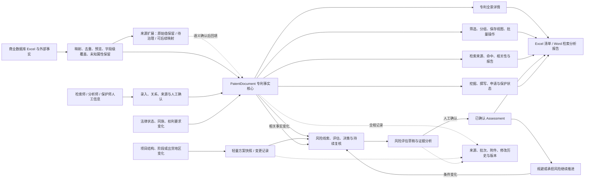
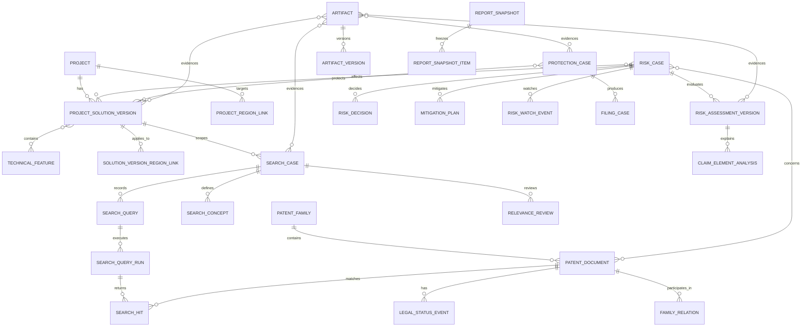
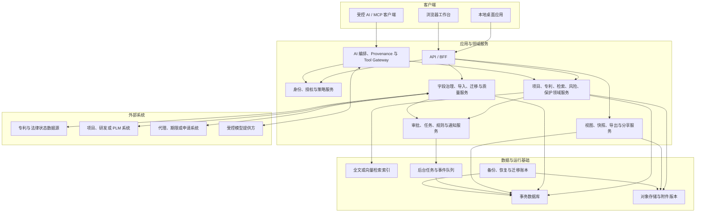

# 22 - PatWiki 目标产品全景架构

> 状态：`discussion baseline / target state`
> 更新：2026-08-15
> 本文描绘全部能力建成后的逻辑产品形态，用于业务讨论、范围裁剪和架构决策。它不是当前功能清单，也不是生产部署方案；2026 范围以 `23-2026-product-scope-and-business-rules.md` 为准，当前实现边界以 `21-implementation-contract.md` 为准。

## 1. 产品定位

目标态的 PatWiki 首先是**以每篇专利为锚点的全维度交互数据库**。专利事实、同族、法律状态、权利要求、产品/项目/技术分类、检索相关性、风险判断、保护信息、附件和历史，都从统一专利入口查看、筛选、组合和输出。

在这一可靠数据核心之上，PatWiki 可以长期演进出检索、风险、保护和团队协作能力，但这些工作台是专利信息中心的增强层，不是彼此独立的系统，也不是 2026 年 P0 的前置条件。

它同时解决五类问题：

1. **统一专利事实**：同一篇专利的身份、著录、同族、法律状态和来源不再被多张表重复维护。
2. **聚合专利上下文**：检索、分析、风险、保护、项目和技术信息都能回到具体专利，并保留各自生命周期。
3. **保留依据**：状态用事件、结论用版本、决策只追加；任何结果都能追到来源和证据。
4. **控制风险**：对外事实、AI 建议、专业判断和正式决策严格分层，不能互相覆盖。
5. **可复用输出**：Excel 台账、Word 检索/分析报告和专题材料从保存视图与专利源数据生成，而不是重复复制著录信息。

## 2. 全景功能架构图

```mermaid
flowchart TB
    subgraph actors["使用角色"]
        RD["研发与项目团队"]
        SEARCHER["检索师"]
        ANALYST["分析师与法务"]
        PROTECTOR["保护师与代理协同"]
        LEADER["管理者与决策者"]
        STEWARD["数据管理员"]
        EXTERNAL["外部合作方"]
    end

    subgraph experience["PatWiki 产品体验"]
        PATENT["专利信息中心：列表、全景详情、关系钻取"]
        VIEW["交互视图：搜索、筛选、分组、批量操作"]
        REPORT["Excel / Word 输出与 SavedView"]
        PROJECT["项目与方案上下文"]
        SEARCH["检索关联信息与长期工作台"]
        RISK["风险跟踪与长期工作台"]
        PROTECTION["保护关联信息与长期工作台"]
        EVIDENCE["证据与附件中心"]
        GOVERNANCE["字段治理与数据质量中心"]
        ADMIN["长期：组织、权限与集成管理"]
    end

    subgraph domains["共享领域数据与工作流"]
        MASTER["主数据：人员、部门、产品线、品类、产品、项目"]
        SOLUTION["方案上下文：ProjectSolutionVersion、技术特征、地区、阶段"]
        KNOWLEDGE["专利事实：PatentDocument、Family、LegalStatusEvent、关系"]
        SEARCH_DOMAIN["检索域：SearchCase、Concept、Query、Run、Hit、Review"]
        RISK_DOMAIN["风险域：RiskCase、Assessment、Decision、Mitigation、Watch"]
        PROTECTION_DOMAIN["保护域：ProtectionCase、Filing、Docket、OfficeAction"]
        ARTIFACT["证据域：Artifact、Version、ArtifactLink"]
        SNAPSHOT["输出域：ReportSnapshot、SharePackage"]
    end

    subgraph control["数据治理与控制面"]
        FIELD["Field Registry 与 Alias Registry"]
        LINEAGE["来源、质量、迁移隔离与业务键"]
        AUDIT["AuditEvent、版本链与审批"]
        POLICY["身份、授权范围、敏感度与发布策略"]
        AUTOMATION["规则、任务、通知与 WatchEvent"]
        AI["AIExecution、评审、过期与 Tool Registry"]
    end

    subgraph platform["平台服务与外部连接"]
        API["领域 API 与事务服务"]
        JOBS["导入、同步、迁移与后台任务"]
        CONNECTOR["专利数据 Connector 与代理/项目系统集成"]
        MCP["受控 MCP / AI Tools"]
        STORE["关系数据、对象存储、检索索引与备份"]
    end

    RD --> PATENT
    SEARCHER --> PATENT
    ANALYST --> PATENT
    PROTECTOR --> PATENT
    LEADER --> REPORT
    STEWARD --> GOVERNANCE
    EXTERNAL --> SNAPSHOT

    PATENT <--> VIEW
    PATENT --> REPORT
    PATENT --> PROJECT
    PATENT --> SEARCH
    PATENT --> RISK
    PATENT --> PROTECTION
    PATENT --> EVIDENCE
    PATENT --> KNOWLEDGE
    PROJECT --> MASTER
    PROJECT --> SOLUTION
    SEARCH --> SEARCH_DOMAIN
    RISK --> RISK_DOMAIN
    PROTECTION --> PROTECTION_DOMAIN
    EVIDENCE --> ARTIFACT
    REPORT --> SNAPSHOT
    GOVERNANCE --> FIELD
    ADMIN --> POLICY

    SOLUTION <--> SEARCH_DOMAIN
    SOLUTION <--> RISK_DOMAIN
    SOLUTION <--> PROTECTION_DOMAIN
    KNOWLEDGE <--> SEARCH_DOMAIN
    KNOWLEDGE <--> RISK_DOMAIN
    ARTIFACT <--> SEARCH_DOMAIN
    ARTIFACT <--> RISK_DOMAIN
    ARTIFACT <--> PROTECTION_DOMAIN
    RISK_DOMAIN --> SNAPSHOT
    PROTECTION_DOMAIN --> SNAPSHOT
    SEARCH_DOMAIN --> SNAPSHOT

    FIELD -. "字段语义与存储策略" .-> MASTER
    FIELD -.-> KNOWLEDGE
    FIELD -.-> SEARCH_DOMAIN
    FIELD -.-> RISK_DOMAIN
    FIELD -.-> PROTECTION_DOMAIN
    LINEAGE -. "来源与质量" .-> MASTER
    LINEAGE -.-> KNOWLEDGE
    AUDIT -. "审计与版本" .-> SEARCH_DOMAIN
    AUDIT -.-> RISK_DOMAIN
    AUDIT -.-> PROTECTION_DOMAIN
    POLICY -. "范围与发布控制" .-> API
    AUTOMATION --> JOBS
    AI --> MCP

    API --> MASTER
    API --> SOLUTION
    API --> KNOWLEDGE
    API --> SEARCH_DOMAIN
    API --> RISK_DOMAIN
    API --> PROTECTION_DOMAIN
    API --> ARTIFACT
    API --> SNAPSHOT
    JOBS <--> CONNECTOR
    JOBS <--> STORE
    API <--> STORE
    MCP --> API
```

阅读方式：专利信息中心是用户入口，检索、风险、保护和项目是围绕专利展开的上下文；中层仍按业务真相分域存储，下层负责治理、服务和外部连接。完整工作台与团队能力是长期演进方向，当前先交付图中的专利中心、交互视图、导入治理和工作文件输出。

## 3. 用户看到的产品形态

| 区域 | 主要用户 | 解决的问题 | 核心产物 | 当前定位 |
|---|---|---|---|---|
| 专利信息中心 | 检索、分析、保护 | 一篇专利的全部事实、关系、判断、文件和历史如何统一调用 | PatentDocument、Family、来源、全景详情 | 2026 P0 中心 |
| 交互视图与输出 | 检索、分析、保护 | 如何快速形成各类台账、清单和 Word 工作文件 | SavedView、Excel 模板、Word 数据装配 | 2026 P0 中心 |
| 字段治理与导入 | 检索师、数据维护者 | 外部 Excel 如何重复导入且不破坏人工信息 | Field Registry、映射、批次、冲突与质量问题 | 2026 P0 基础 |
| 专利关系与分类 | 检索、分析、保护 | 如何按产品、项目、技术、竞对、专题找到专利 | 结构化关系、来源、确认状态 | 2026 P0/P1 |
| 检索关联信息 | 检索师 | 某篇专利从何次检索获得、相关性如何、报告在哪里 | 来源、命中、相关性、报告附件 | 先轻量，后扩展 Case |
| 风险跟踪 | 检索、分析、领导、研发 | 风险如何初判、确认、接受、规避和持续复核 | 评估版本、Decision、Watch、方案上下文 | 2026 P1 |
| 保护关联信息 | 检索、保护 | 与专利锚定的挖掘、撰写、申请和保护状态在哪里 | 保护状态、我方申请、附件 | 先轻量，完整 Docket 暂缓 |
| 项目方案上下文 | 检索、分析 | 某次判断对应哪个阶段、结构和出货地区 | 轻量方案快照、变更记录 | 按风险需要建设 |
| 团队协作与管理 | 团队、管理者、外部合作方 | 多人权限、跨设备、任务和外部集成如何运行 | 认证、授权、任务、连接器、SharePackage | 长期参考 |

## 4. 业务联动图

这里的产品中枢是 **PatentDocument**。`ProjectSolutionVersion` 是风险判断需要时使用的上下文，用来说明具体技术方案、时间点和适用地区；它不是普通专利导入、分类、查询和导出的必选前置对象。

## 5. 核心数据关系

这张关系图刻意不把多值业务关系压缩成文本或 JSON ID 数组。链接一旦包含角色、来源、确认人、有效期或业务意义，就应落为独立关系实体。

## 6. 控制面：什么能自动化，什么必须由人确认

| 能力 | 可以自动完成 | 必须经过人工与服务端控制 |
|---|---|---|
| 导入与同步 | 格式校验、标准化建议、去重候选、来源记录、未知属性保留、真正异常隔离 | 覆盖主数据、接受不确定匹配、处理冲突、确认未知属性语义 |
| AI | 提取、翻译、分类建议、相似案例提示、报告草稿、检索建议 | 确认风险、签发结论、接受风险、改变申请策略、对外发布 |
| 自动化规则 | 生成待办、WatchEvent、评估草稿、重算兼容缓存、通知 | 关闭风险、确认 Assessment、创建 RiskDecision、提交正式申请策略 |
| 报告 | 汇总、渲染草稿、字段完整性检查、快照生成 | 审核、脱敏确认、发布、外部分享 |
| MCP / Tools | 受范围限制的只读上下文、创建 draft 的受控工具 | 任意 SQL、任意表写入、绕过审批的责任数据写入 |

无论是人工、自动化还是 AI，写入都要经过同一条链路：**身份与范围 -> 领域校验 -> 事务写入 -> AuditEvent -> 后续任务/WatchEvent**。

## 7. 逻辑技术架构

### 部署演进边界

逻辑架构不预设唯一部署方式，但必须保持领域服务、治理控制和存储边界一致：

| 模式 | 适用范围 | 事务存储与附件 | 关键限制 |
|---|---|---|---|
| 本地优先模式 | 单人或单机受控试点 | SQLite + 本地附件目录 + 本机备份 | 不可假设多人认证、跨设备并发或真实对外分享已安全可用 |
| 团队协作模式 | 多人、跨设备、共享案例 | 服务端关系数据库 + 对象存储 + 队列 | 必须先具备认证、服务端授权、审计、备份恢复和并发策略 |
| 对外集成模式 | 外部数据同步、合作方分享、MCP | 受控 Connector、SharePackage、Tool Gateway | 不允许把数据库、附件路径或任意 SQL 直接暴露给外部系统或模型 |

当前仓库仅具备本地优先原型的部分基础。团队协作和对外集成是目标能力，不能被当作已上线事实。

## 8. 长期管理洞察（当前暂缓独立建设）

当专利信息中心、关系和风险历史足够可靠后，可以自然生成以下管理洞察；当前不单独建设大规模驾驶舱，也不以这些指标倒逼 P0 数据模型扩张：

- 临近项目 Gate 的 High/Critical 风险、未完成规避和待签发决策；
- 最近因法律状态、同族、方案或出货地区变化而重开的风险；
- 按项目、产品品类、技术特征和法域观察的风险热区；
- 技术特征对应的我方保护覆盖、保护空白、在审布局和临期期限；
- 各组 Case 负载、逾期、复核队列和数据质量问题；
- 报告版本、外部分享范围、有效期和撤销记录。

每个指标都必须能回到具体的 Case、方案版本、专利事实、证据、确认记录和审计链，而不是只显示一个无法解释的汇总数字。

## 9. 后续讨论仍需确认的产品细节

详情页、首批高频表格、号码匹配和增量导入规则已经在 24 号规格中确认。下列信息仍需随真实工作文件逐步补充：

1. 各高频 Excel 的最终列顺序、样式和工作表命名是什么？
2. Word 检索报告的固定章节、表格和专利引用格式是什么？
3. 风险等级、结论、确认动作和“接受风险继续”的页面枚举是什么？
4. 哪些项目变化必须形成新方案快照，哪些只需记录备注或事件？
5. 专利权人、申请人、受让人的供应商字段如何映射？
6. 代表附图应从哪里取得，如何选择默认图？
7. 哪些附件属于高敏材料，是否允许进入模型上下文？

这些细节不再阻塞身份、详情、增量导入、Wiki 血缘和首批保存视图开发；团队化、跨设备和外部系统集成继续暂缓。
