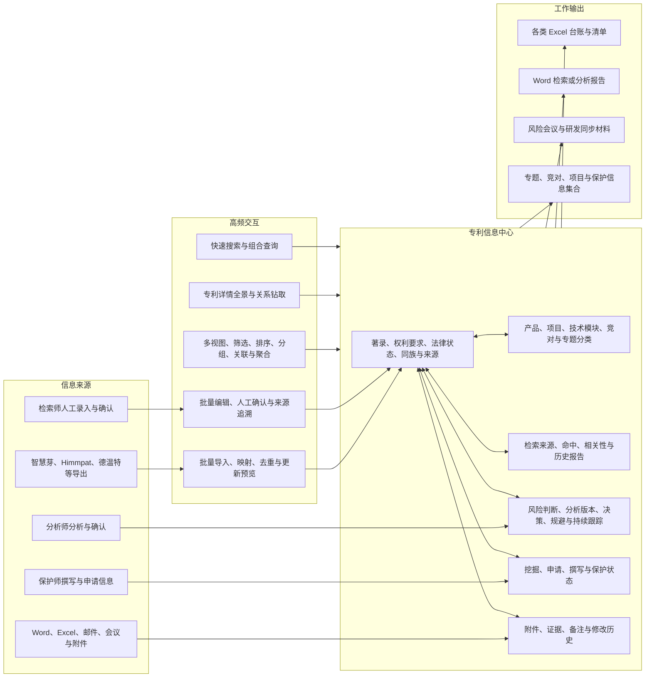
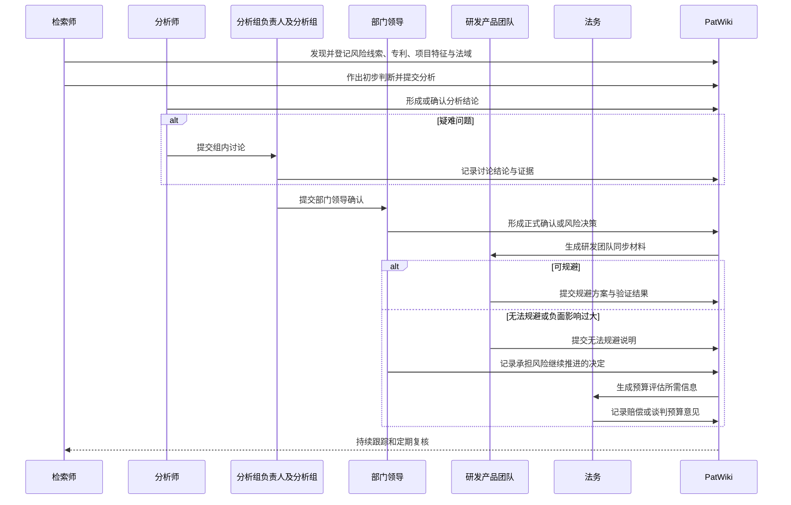

# 23 - 2026 产品范围与已确认业务规则

> 状态：`business-confirmed / scope baseline`
> 更新：2026-08-15
> 本文记录 2026-08-14 沟通确认的产品边界和业务事实。若长期全景架构与本文的当年优先级冲突，以本文为准。

## 1. 今年唯一的产品中心

2026 年 PatWiki 的最高目标是：

**打造一个以每篇专利为锚点、覆盖专利相关全维度信息、适合高频检索分析保护工作、能够快速查询调用并生成各类工作文件的优秀本地交互数据库。**

今年不以建设全面的 IP 工作流平台、跨部门协同系统或云端多人系统为目标。检索、分析、风险和保护能力应作为专利数据库的关联信息与高频操作进入产品，而不是各自建设一套庞大的工作台。

“以专利为中心”不等于把所有内容都塞入 `patents` 物理表。页面上以专利为统一入口，存储上仍按事实、关系、事件和版本分层，避免风险结论、项目关系、分析记录和申请过程互相覆盖。

## 2. 今年的产品形态

用户打开某篇专利时，应能在一个统一详情入口查看：

- 可信来源的著录、权利要求、法律状态、同族和更新时间；
- 该专利所属产品、项目、技术特征、竞对、专题和检索来源；
- 与该专利有关的历次初步判断、正式分析、风险会议、规避或风险接受；
- 与该专利有关的我方保护、申请、报告、证据和附件；
- 谁在什么时间以什么来源写入或修改了哪项信息。

## 3. 已确认的运行边界

| 主题 | 已确认事实 | 产品决定 |
|---|---|---|
| 运行方式 | 当前首先服务单人本地使用 | 继续以 Tauri + FastAPI + SQLite 为当前主路径，先补迁移、备份和数据完整性，不设计云端架构。 |
| 团队化 | 后续会成为团队工具 | 数据模型避免把操作者写成自由文本，但认证、多人并发和跨设备访问暂不进入当前实施范围。 |
| 跨设备 | 暂时不需要，未来可能需要 | 不为未来可能性提前引入服务端数据库、对象存储、消息队列或复杂权限系统。 |
| 来源台账 | 31 类表全部仍在真实使用 | 不能把它们简单归为历史遗留；必须支持其信息查询和工作文件输出，逐步减少重复维护。 |
| 数据维护 | 除分析和撰写相关内容外，大多由检索师维护 | 检索师是当前主要数据管理员和录入者；交互效率、批量操作和可恢复性优先。 |
| 外部覆盖 | 著录项目等事实信息可由商业数据库的新导出更新 | 只允许按字段更新策略覆盖外部事实；人工判断、内部分类、风险和保护信息不得被导入直接覆盖。 |
| 主数据 | 产品线、品类、产品、项目和技术模块目前均由检索师人工录入 | 当前不接 ERP/PLM；保留来源和人工确认状态，为未来映射留接口即可。 |
| 样本与规模 | 暂无可用于迁移分析的脱敏真实样本 | 不预设数据量和性能承诺；先建立可重复导入、隔离和差异报告，再用真实数据校准。 |

SQLite 在这个边界下仍然合适，但前提是完成版本化迁移、运行时外键、备份恢复、事务写入和数据完整性校验。单机并不意味着可以继续依赖无版本的容错加列。

## 4. 数据生产和覆盖规则

### 4.1 外部事实

当前可信来源包括智慧芽、Himmpat、德温特等商业专利数据库导出的 Excel。导出内容是导出时点的事实快照，不代表法律状态永久有效。

外部事实更新必须同时保存：

- 来源平台；
- 导入批次和原始文件；
- 来源记录定位；
- 导出或采集时间；
- 原始值和标准化值；
- 本次准备覆盖的旧值与新值；
- 更新结果和异常原因。

法律状态、同族、权利要求等会变化的字段不能只保留当前值。当前值用于快速展示，历史导入快照或事件用于回答“当时看到的是什么”。

### 4.2 人工业务信息

以下信息默认要求人工确认，外部导入和 AI 只能提出建议或草稿：

- 产品、项目、技术模块和专题分类；
- 相关性、初步风险和正式分析结论；
- 项目方案特征及变更；
- 规避结论、风险接受和会议决定；
- 挖掘、撰写、申请和保护策略；
- 研发、法务、领导及保护师反馈。

人工信息必须记录录入人、录入时间、来源材料和确认状态。修改正式结论时保留新版本，不能覆盖旧结论。

### 4.3 项目变化

项目变动点目前均由检索师人工录入，来源可能是：

- 研发人员向检索师描述；
- 检索师自行了解到项目变化；
- 会议、邮件或其他材料中呈现的变更。

当前先实现轻量的“项目方案快照/变更记录”：保存项目、阶段、变更特征、适用地区、来源描述、来源附件、录入人和时间。完整的研发版本管理、BOM/图纸同步和 PLM 集成暂不建设。

## 5. 已确认的风险处理链路

职责链已经明确：

1. 检索师负责发现风险和初步判断；
2. 分析师负责专业分析与确认；
3. 疑难问题由分析组负责人和分析组讨论；
4. 部门领导进行最终确认；
5. 结论同步给研发团队全体；
6. 需要承担风险时，法务计算或建议预留赔偿谈判预算。

风险不是一次性结论。出货地变化、专利保护范围改变、项目结构变化、发现专利性文件、法律状态或同族变化，都可能使原结论过期并触发复核。风险发生后应持续保留，以便后续新项目复用和重新判断。

项目阶段目前确认包括：

- TR1：方案评审；
- TR2：下模评审；
- TR3：ESL 测试；
- TR4：MSL 测试；
- TR5：量产。

风险不自动阻断项目 Gate。若规避负面影响过大，可以通过正式决策记录“承担风险并继续”，同时记录条件、预算意见、后续复核触发因素和持续跟踪状态。

## 6. 检索与保护的当前边界

### 检索

- 检索可能在多个商业平台执行；
- 当前检索全过程主要依赖人工工作；
- 常规正式输出是 Word 检索报告；
- PatWiki 当前优先保存与专利可复用的信息、检索来源、相关性判断、报告附件和必要的检索上下文；
- 完整检索式编排、平台 API 重放和复杂 SearchCase 工作流属于后续增强，不应阻塞专利数据库建设。

### 保护

- 专利申请和挖掘由检索师发起；
- 保护师参与挖掘，并负责撰写及之后的申请推进；
- 已有其他系统承载部分后续流程，当前不考虑接入；
- PatWiki 当前优先保存与专利锚定的挖掘来源、我方申请、撰写/保护状态、关联项目技术和文件；
- 全量 Docket、期限、费用、代理协同和 OfficeAction 工作流不进入当前优先范围。

### 已确认的详情、台账与导入规则

- 当前详情页分区基本合理，后续按阅读任务调整为著录与附图、加工信息、权利要求、说明书、同族与法律状态、分类与知识关联、项目与风险、我司保护与申请、附件与证据、Wiki 历史；详细字段和交互见 `24-patent-information-hub-functional-spec.md`。
- 风险会风险统计表、品类我司专利申请类、IP事务管控表之风险管控表、IP事务管控表之申请管控表、产品品类数据总库、日常相关专利积累是首批高频视图；除中间过程类外，大多数表格都按活跃高频输出处理。
- 同一申请的申请号、申请公开号和授权公告号归入同一篇专利；不同国家/地区同族成员保持独立记录并通过同族关系连接。
- 重复导入先补充非冲突增量；相同值仍记录来源，格式差异和内容差异由系统分类并交用户确认，身份冲突阻断整行。
- 每次导入都在 Wiki 历史记录导入时间、工作簿、表格/工作表标题、来源行和字段处理摘要。

## 7. 2026 功能优先级

### P0：必须做好

1. **专利统一身份与去重**：申请号、公开号、授权号、国家、同族和外部 ID 的规范化、匹配和冲突处理。
2. **全维度专利详情**：字段分组清晰，事实、分类、关系、分析、风险、保护、附件和历史从一个入口调用。
3. **可靠批量导入**：字段映射、导入预览、覆盖策略、异常隔离、来源批次、撤销或恢复能力。
4. **高效交互表格**：快速筛选、搜索、排序、分组、列配置、批量编辑、关系钻取和保存视图。
5. **字段治理**：canonical field、alias、数据类型、来源、更新时间、人工确认、覆盖策略和审计规则。
6. **专利关系**：项目、产品、技术模块、专题、竞对、检索结果、风险、我方保护和附件的结构化关联。
7. **工作文件输出**：从视图或选中专利生成可配置 Excel 清单和 Word 检索/分析报告所需数据。
8. **本地可靠性**：版本化迁移、事务、外键、备份恢复、导入重跑和历史兼容。

### P1：围绕专利的必要业务支持

- 风险线索、初步判断、分析确认、疑难讨论、领导确认、风险接受和持续复核；
- 项目方案快照、TR 阶段、出货地区和变化来源；
- 检索报告、相关性结果和检索来源；
- 挖掘、撰写、申请和保护状态；
- 附件版本、证据引用和修改历史；
- 月度竞对新公开专利跟踪及风险复核列表。

### 暂缓

- 云端、多租户、跨设备访问和复杂多人并发；
- 全面的 RBAC/ABAC、跨部门审批编排和任务 SLA；
- ERP、PLM、代理或期限系统集成；
- 完整 SearchCase、Docket、费用和 OfficeAction 工作流；
- 通用 MCP 写入、复杂自动化平台和对外协作门户；
- 为管理层单独建设大规模驾驶舱。

暂缓不代表目标模型必须删掉这些扩展点，而是当前不应为它们建设页面、服务和基础设施，也不允许它们改变 P0 排期。

## 8. 产品验收标准

当下列能力成立时，才可以称为“优秀的专利信息数据库”：

- 任意一篇专利可在一个入口看到所有已录入的相关事实、关系、判断、文件和历史；
- 同一事实不需要在多张表重复修改，现有 31 类工作文件可逐步由数据库查询和导出生成；
- 新的商业数据库导出可以重复导入，不产生重复专利，也不会无提示覆盖人工信息；
- 用户可以在几步内找到某项目、产品、技术特征、竞对、法域或风险涉及的全部专利；
- 列配置、筛选条件和导出模板能够复用，不需要每次重新整理表格；
- 风险初判、分析确认、领导决定和后续复核不会相互覆盖；
- 每个关键字段能回答“谁、何时、从哪里、为什么写入或更新”；
- SQLite 数据文件和附件能够可靠备份、升级、校验和恢复。

## 9. 后续逐步补充

以下内容可以随着真实工作文件逐步补充，不阻塞专利信息中心的身份、详情和导入开发：

1. 六个首批高频表格及其余活跃表格的最终列顺序、列宽、样式和工作表名称；
2. Word 检索报告的固定章节、表格和专利引用格式；
3. 风险等级和结论的具体枚举、确认动作及显示方式；
4. 哪些项目变化必须形成新方案快照，哪些只记一条备注或事件；
5. 专利权人、申请人、受让人的供应商字段映射；
6. 代表附图的来源、默认选择和缓存方式；
7. 哪些附件属于高敏材料，是否允许进入模型上下文。
