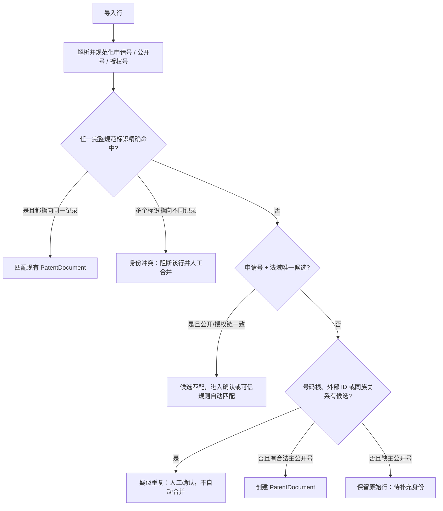

# 24 - 专利信息中心功能规格

> 状态：`business-confirmed / implementation specification`
> 更新：2026-08-15
> 本文把 `23-2026-product-scope-and-business-rules.md` 的产品范围继续细化为详情页、专利身份、增量导入、Wiki 历史和高频表格视图规格。发生冲突时，业务范围仍以 23 号文档为准；人工录入的低门槛交互以 `26-human-data-entry-interaction-spec.md` 为补充约束。

## 1. 已确认结论

1. 当前专利详情页的分区思路基本合理，不需要推倒重做，但应从“按代码模块分 Tab”调整为“按阅读和工作任务分页面”。
2. 一篇专利以公开号体系作为首要唯一识别依据；申请号可以关联公开和授权两个号码，同一国家申请的公开、授权标识应归入同一 `PatentDocument`，不能生成两篇重复专利。
3. 同族页展示的是各同族成员的公开号；同族关系只建立关联，不能因为属于同族就合并不同国家/地区的 `PatentDocument`。
4. 重复导入先做身份校验和非冲突增量补充；发现差异时必须展示给用户确认是格式差异还是内容差异，不能静默覆盖。
5. 每次导入都必须在专利 Wiki 历史中记录导入时间、工作簿、表格/工作表标题、来源行和字段处理结果，即使本次没有改变当前值。
6. 除中间过程类外，大多数现有表格都是高频使用产物。系统不能因其最终输出“只是一张表”而低估价值；应通过保存视图和导出模板逐步承接。

## 2. 当前详情页基线与调整原则

当前 `PatentDetailPage.tsx` 已有基础著录、技术信息、风险与应用、AI 分析、附件、自定义字段、关联关系、修改历史和评论等分区，可直接复用加载、编辑、附件、历史和关系能力。

主要问题不是页面数量，而是当前分组受存储实现影响：

- `AI 分析` 是生产方式，不应成为与专利正文并列的业务分类；
- `自定义字段` 是存储方式，不应长期成为用户查找信息的目的地；
- 风险、项目、我司申请和普通技术关系混在 Patent 单值字段与通用关系中，难以还原上下文；
- 修改历史只记录字段旧值/新值，还不能完整表达一次导入观察了什么、来自哪张表、哪些值未发生改变。

调整原则：保留现有页面和 API 的兼容读取，新增聚合读模型；字段根据 Field Registry 投影到业务页面，用户不需要知道它来自系统列、关系表、事件表还是 CustomField。

## 3. 专利详情信息架构

详情页顶部保留一个不随 Tab 切换的身份区：标题、主公开号、申请号、授权号、国家/地区、专利类型、当前法律状态、最新来源时间、未解决导入冲突数、开放风险数。标题和主标识可复制，来源时间和冲突数可直接进入 Wiki 历史或导入确认页。

建议使用以下十个一级页面；桌面端可用顶部或左侧 Tab，窄屏可改为下拉目录。每页独立延迟加载，避免权利要求、说明书、同族和历史一次性阻塞首屏。

| 页面 | 主要内容 | 高频动作 | 数据边界 |
|---|---|---|---|
| 1. 著录与附图 | 标题、摘要、公开号、申请号、授权号、专利权人、申请人、发明人、代理信息、优先权日、申请日、公开日、授权日、预计失效日、国家、专利类型、IPC/CPC、代表附图 | 复制编号、打开原文、查看字段来源、确认导入差异 | 外部事实当前值 + 字段来源观察；代表附图是 Artifact 或外部图片引用 |
| 2. 加工信息 | 标题/摘要/权利要求翻译，技术问题、技术方案、技术效果、保护点概要、实施例总结、人工分析摘要 | AI 生成草稿、人工修订、确认、查看原文依据 | AI 输出、人工覆盖和正式人工值分层；保留模型、输入哈希和确认状态 |
| 3. 权利要求 | 当前权利要求全文、独立权利要求导航、原文与翻译对照、权利要求版本、来源与导入时间 | 按项定位、复制、对照、引用到分析 | 长文本版本对象；新内容不得直接覆盖旧版本 |
| 4. 说明书 | 说明书全文、段落导航、实施例、附图说明、全部附图与原文定位 | 全文搜索、段落引用、图文联动 | 长文本/文档版本 + Artifact，不塞入普通列表接口 |
| 5. 同族与法律状态 | 同族成员公开号、国家/地区、关系类型、申请/公开/授权信息、当前法律状态、法律状态事件和来源时间 | 展开同族、切换成员、比较法域、查看状态历史 | `PatentFamily + PatentIdentifier + FamilyRelation + LegalStatusEvent` |
| 6. 分类与知识关联 | 产品线、产品品类、产品、技术模块/特征、竞对、专题、标签、检索来源、相关性、历史分析报告 | 增删关联、批量分类、按关系反查专利 | 所有关联带来源、确认状态、录入人和时间；多值不得存逗号文本 |
| 7. 项目与风险 | 关联项目、项目阶段/方案快照、出货地区、风险主题、风险专利角色、初判、分析版本、会议决定、规避/接受风险、复核触发与跟踪状态 | 新增风险线索、查看责任链、复核、打开证据 | 项目关系与 RiskCase 分层；Patent 风险单值只作兼容汇总 |
| 8. 我司保护与申请 | 挖掘来源、保护主题、我司申请号/公开号、布局国家、撰写/申请/授权状态、关联项目和技术模块 | 关联我司申请、查看保护覆盖、打开撰写材料 | 当前先保存专利锚定信息，不建设完整 Docket/期限/费用流程 |
| 9. 附件与证据 | 专利原文、Word/Excel、报告、邮件、会议材料、图片和外链 | 上传、预览、下载、关联、查看版本 | `Artifact + ArtifactVersion + ArtifactLink`；旧附件兼容读取 |
| 10. Wiki 历史 | 手工修改、批量修改、每次导入、AI 生成/覆盖、关系变化、风险结论版本和附件版本 | 按来源/日期/批次筛选、展开字段差异、跳转导入冲突 | 展示聚合时间线，底层保留字段观察、事件和版本，不能只依赖 `updated_at` |

### 3.1 不再保留的长期一级页面

- `AI 分析`：并入“加工信息”，AI 是来源标签和操作方式。
- `自定义字段`：按 Field Registry 投影到对应业务页；只有治理/调试入口可以查看未分类字段。
- `评论`：普通备注进入 Wiki 时间线或侧边评论面板，不占用专利正文一级页。
- `技术信息`：拆入加工信息、分类与知识关联、项目与风险，避免事实、AI 摘要和业务判断混在一起。

## 4. 专利身份与号码模型

### 4.1 “同一篇专利”的范围

当前业务口径下，一个 `PatentDocument` 表示一个国家或地区中的同一申请链记录，可以同时拥有：

- 申请号 `application_number`；
- 申请公开公开号 `publication_number`；
- 授权公告号 `grant_number`；
- 商业数据库外部 ID；
- 历史原始写法和规范化别名。

公开阶段和授权阶段不是两篇独立专利。不同国家/地区的同族成员仍是不同 `PatentDocument`，通过 `PatentFamily` 关联。

### 4.2 PatentIdentifier

不要继续假设 `patents` 的三个字符串列足以完成长期去重。新增兼容关系实体 `PatentIdentifier`：

| 字段 | 说明 |
|---|---|
| patent_id | 所属 `PatentDocument` |
| identifier_namespace | official 或商业来源命名空间；避免不同平台 external ID 碰撞 |
| identifier_type | application / publication / grant / external |
| raw_value | 导入时原始号码，永不因规范化丢失 |
| normalized_value | 用于精确匹配的规范化号码，包含国家/地区前缀和号码种类代码 |
| jurisdiction_code | 国家/地区标准代码 |
| kind_code | A、B、U、S 等公开种类代码；不能直接丢弃 |
| source_system / source_timestamp | 本次观察来源和来源时间 |
| is_primary | 是否投影到当前 `patents` 兼容列 |
| valid_from / valid_to | 标识有效期或来源有效期，可空 |

`identifier_namespace + normalized_value + identifier_type` 在本地专利主库中唯一；官方号码统一使用 `official` 命名空间。兼容期继续把主申请号、公开号和授权号投影到 `patents.application_number/publication_number/grant_number`。

### 4.3 号码规范化

规范化用于匹配，不修改原始显示值：

1. Unicode NFKC，统一全角/半角；
2. 去除首尾空白、内部普通空格、不可见字符和纯格式分隔符；
3. 拉丁字母转大写；
4. 解析国家/地区前缀、主体号码和 kind code；
5. 保留包含 kind code 的完整规范号作为精确键；
6. 可另生成去 kind code 的号码根用于候选提示，但号码根不能单独自动合并；
7. 所有解析失败值进入隔离，不以模糊字符串直接创建重复专利。

### 4.4 身份解析顺序

同一行中的申请号、公开号和授权号如果分别命中不同专利，属于最高优先级身份冲突，整行不得部分写入。`PatentFamily` 只能提供候选关系，不能作为合并依据。

## 5. 增量导入与差异确认

### 5.1 三层数据

每个外部字段同时区分：

1. **来源观察值**：某次导入具体看到了什么；永久保留。
2. **候选规范值**：经过号码、日期、人员列表、IPC 等规则标准化后的值。
3. **当前采用值**：详情页和导出默认使用的值；只能按字段策略更新。

来源观察不能因为与当前值相同就被丢弃，否则无法回答“这张表在这一天提供了什么信息”。同样，系统暂时不认识的列也不能因为没有 canonical field 就丢弃；它们先进入来源扩展层，等待后续治理。

### 5.2 差异分类

| 分类 | 判定 | 默认动作 |
|---|---|---|
| `new_value` | 当前为空，来源提供合法值；或多值集合出现新的明确成员 | 增量写入当前值，标记本批新增，可由用户在批次确认页复核 |
| `same_value` | 原始写法或规范值完全相同 | 不改当前值，仍记录来源观察和本次导入历史 |
| `format_only` | NFKC、空白、换行、标点、大小写或显示格式不同，规范化内容相同 | 不产生内容覆盖；界面显示系统建议“格式差异”，用户可确认分类 |
| `content_conflict` | 日期、主体、标题、摘要、权利要求、说明书或其他事实规范化后仍不同 | 保存候选值和差异，不覆盖当前值，必须由用户选择保留、采用或另存版本 |
| `identity_conflict` | 同一行标识命中多个专利，或主公开号与申请链矛盾 | 阻断该行全部写入，先解决身份 |
| `protected_conflict` | 导入试图修改人工分类、分析、风险、保护或内部关系 | 禁止覆盖，只可作为待人工处理的建议或直接忽略并记录原因 |

### 5.3 字段类型处理

- 标识和日期：严格解析；差异进入冲突，不做“较新来源自动获胜”。
- 申请人、专利权人、发明人、IPC/CPC 等集合：新增成员可增量加入；删除、替换或成员角色变化需确认。
- 标题和摘要：格式差异不覆盖；内容差异保留候选值和来源版本。
- 权利要求、说明书、法律状态：按来源时间形成版本或事件，不能只保留最后一个长文本。
- 人工分类、相关性、风险和保护信息：商业数据库导入没有覆盖权。
- 预计失效日：保留来源和计算/供应商口径；发生变化时要求确认或形成新派生版本。

### 5.4 批次确认页

导入预览和执行结果至少按以下桶显示：新增专利、匹配并补充、值相同、格式差异、内容冲突、身份冲突、受保护字段冲突、隔离错误。用户可按字段、来源表或专利批量确认，但每个决定仍要落到字段观察记录。

### 5.5 未知属性：保留而不污染

导入列没有匹配到 Alias Registry 或 canonical field 时，不得直接丢弃，也不应直接写入 `Patent.custom_fields`。系统按以下方式处理：

    1. 保存原始工作簿 Artifact、文件哈希、工作表、列标题、列序号、来源行和原始单元格值；
2. 为来源列生成稳定键，例如 `source:<table_title>:<column_name>`，并将字段标记为 `unmapped_retained`；
3. 如果行身份已匹配专利，将未知属性关联到该专利的来源观察；如果身份未匹配，仍保留完整原始行，不强行创建专利；
4. 在导入结果中单独显示“未注册属性（已保留）”，支持按来源列、专利、批次筛选和导出；
5. 允许用户把它映射到已有字段、提交为新字段候选、标记为来源专用字段或忽略未来展示；历史观察永不删除；
6. 只有经过语义确认的属性才进入正式字段、关系、统计和默认详情页。

因此，未知属性有三种后续命运：继续作为来源扩展字段保留；被确认后升级为正式字段；被确认无业务价值后停止默认展示但仍按保留策略保留原始证据。真正的数据错误才进入 `quarantined`。

### 5.6 缺失字段和来源行处理

- 标题不是导入创建的唯一前置条件。只要行中有合法的申请号、公开号或授权号，系统就应创建或匹配身份锚定的 Patent；标题为空时显示“待补全”，并将其作为待补全状态而不是正式标题事实。
- 行没有官方身份标识但存在标题、备注或其他非空内容时，系统不得创建无法回溯的正式 Patent，也不得丢弃整行；应保存 `ImportSourceRow`、原始文件和 `FieldObservation`，进入“待补身份”队列，后续补号后可回放。
- 只有整行没有任何非空内容时才可统计为“空行跳过”。缺少标题、摘要、申请人、日期或其他非核心字段不能导致其他合法字段一并跳过。
- 导入确认请求中未出现的列必须按“保留原始列”处理；前端展示的空映射不是“不导入”，用户必须选择显式“跳过本列”才改变该列状态。

## 6. 导入来源与 Wiki 更新记录

### 6.1 ImportBatch 必填元数据

- `workbook_filename`：原文件名；
- `source_table_title`：用户看到的台账/表格标题，例如“产品品类数据总库”；
- `worksheet_name`：Excel 工作表名；
- `source_system`：智慧芽、Himmpat、德温特、内部台账或其他；
- `mapping_version`：使用的字段映射版本；
- `imported_at`：实际导入时间；
- `source_exported_at`：来源文件导出时间，可空；
- `file_hash`：防止同一文件误重复执行，同时允许显式重跑。

当前 `ImportBatch.filename`、计数和 `Patent.source_batch_id/source_row` 可兼容保留，但不足以表达表格标题、工作表和逐字段观察。

### 6.2 PatentImportEvent 与 FieldObservation

每篇被导入行命中的专利，每个批次至少形成一条 `PatentImportEvent`，字段包括：专利、批次、来源行、匹配依据、处理结果、观察字段数、新增数、等价值数、冲突数和确认状态。

每个非空导入字段形成 `FieldObservation`：来源列名、canonical field（可以为空）、raw value、normalized value、旧采用值、候选值、差异类型、字段解析状态、默认动作、最终决定、决定人和决定时间。未知属性的 `canonical_field` 为空，但不得因此不记录。

对于无法匹配专利身份的行，先形成 `ImportSourceRow`，状态为 `unmapped_retained` 而不是错误丢弃；身份补充后可以回放该行，不需要重新向用户索要原始文件。只有原始行损坏、解析失败或违反完整性约束时才标记 `quarantined`。

Wiki 历史按专利和批次聚合显示，例如：

> 2026-08-15 10:32 从“产品品类数据总库”/Sheet1 导入：观察 19 个字段，新增 3 项，12 项相同，2 项格式差异，2 项待确认。匹配依据：公开号 CNxxxxxxA。

展开后才能看到逐字段差异。这样既满足“每项信息可追溯”，又不会用 19 条平铺记录淹没时间线。

现有 `PatentHistory` 继续展示手工、批量和 AI 的兼容历史；导入历史优先从 `PatentImportEvent + FieldObservation` 聚合，不要为未变化字段伪造旧值/新值修改记录。

## 7. 高频表格收敛为视图族

现阶段不要求立即给出每张表的最终列宽、样式和 Word 章节。先冻结“数据集范围 + 行粒度 + 核心字段族 + 输出类型”，以后补充模板格式不会反向改变专利主数据。

| 高频表格 | 建议视图族 | 一行代表 | 首批核心字段族 | 输出 |
|---|---|---|---|---|
| 风险会风险统计表 | 风险会议与持续跟踪视图 | 一项风险 × 一篇核心风险专利，可展开同族和项目 | 专利、权利人、风险主题/等级、发现原因、处理方式、会议时间/结论/决策人、负责人、项目、规避/跟踪状态、报告与证据 | Excel；后续会议材料 |
| 品类我司专利申请类 | 品类保护布局视图 | 一项我司申请 × 品类/项目关系 | 项目号、产品号/名称、品类、保护主题、申请号/公开号、布局国家、法律状态、技术模块 | Excel |
| IP事务管控表之风险管控表 | 单项目风险管控视图 | 一个项目 × 一项 RiskCase × 一篇风险专利 | 项目/产品/人员、地区、TR 阶段、方案变动、风险主题/时间/等级、专利、冲突结论、措施、结案、附件、备注 | Excel |
| IP事务管控表之申请管控表 | 单项目申请管控视图 | 一个项目 × 一项我司申请 | 专利标题、保护主题、申请号/公开号、布局国家、当前法律状态 | Excel |
| 产品品类数据总库 | 品类专利知识库视图 | 一篇专利 × 一个品类关联 | 公开号、标准申请人、日期、预计失效日、同族、独立权利要求/翻译、摘要翻译、技术问题/方案/效果、技术分类、相关性、历史分析、链接与备注 | Excel |
| 日常相关专利积累 | 快速收录 Inbox 视图 | 一次日常发现 × 一篇专利 | 公开号、专利权人、保护点概要、技术模块、产品品类、备注、发现时间/来源 | Excel；确认后进入正式知识关系 |

其他非中间过程表默认同样视为活跃高频输出，按上述方法逐表补规格。中间过程表也不能删除数据，只是可在流程结束后由结构化数据重新生成。

### 7.1 视图和模板分离

- `SavedView` 决定数据范围、筛选、排序、分组、列和展开方式；
- `ExportTemplate` 决定 Excel 列名、顺序、格式、工作表拆分和文件命名；
- `ReportTemplate` 决定 Word 章节、专利引用和表格布局；
- 一个 SavedView 可绑定多个输出模板；模板升级有版本，不复制专利事实。

## 8. 开发拆分

1. 身份规范化库和 `PatentIdentifier` 只读适配，先扫描现有重复/冲突，不直接合并。
2. ImportBatch 来源元数据、原始行保留、行级匹配预览和字段差异分类。
3. `PatentImportEvent + FieldObservation`，接入 Wiki 历史聚合读取；未知属性必须可查询、可导出。
4. 未知属性候选/映射/回填机制，确保语义变化不会造成历史丢失。
5. 专利详情聚合 API 和十页信息架构，先迁移现有字段，再逐页补新关系。
6. 六个已确认高频 SavedView 的数据集与默认列，先支持 Excel 导出。
7. 收集真实导出样式后增加 ExportTemplate 版本和 Word ReportTemplate。

## 9. 验收场景

1. 同一公开号以空格、大小写、全半角或不同显示格式重复导入，只匹配一篇专利，并生成格式差异或等价观察记录。
2. 先导入申请公开号、后导入授权号时，授权号追加到原专利，不新建重复记录。
3. 同一申请号对应公开和授权标识时，详情顶部显示全部标识，同族页不把二者错误显示为两个同族成员。
4. 同族文件公开号导入时创建或匹配独立专利，再建立 FamilyRelation，不合并正文。
5. 当前摘要为空时自动增量补充；当前摘要非空且内容不同时生成待确认冲突，不静默覆盖。
6. 导入值与当前值完全相同时，Wiki 历史仍能看到本次来源表、时间和观察字段。
7. 导入出现未知列时，原始列和值仍可在“未注册属性”视图查询和导出，且不进入默认正式统计。
8. 未知列后来映射为 canonical field 后，历史观察可以回填，且保留原始列名、来源和映射版本。
9. 任取导入后的一个字段，可追溯到工作簿、表格标题、工作表、行号、原始值、规范值和用户决定。
10. 六个高频视图都能从同一专利事实和关系生成 Excel，修改一次专利著录后无需到六张台账重复修改。
11. 无标题有公开号的行形成“待补全”专利；无身份有内容的行形成来源待补身份记录；未知列默认保留且不阻断已知列导入。

## 10. 后续补充但不阻塞当前设计

### 10.1 项目方案与风险分区当前实现

详情页“风险与应用”分区现在包含两个层次：结构化项目方案/风险上下文，以及只读的旧风险投影。结构化录入和字段门禁见 `27-agent-project-risk-module-contract.md`。实现该分区时不得把风险等级下拉框直接绑定到 Patent 主表；需要新增结论时必须追加风险评估版本。

- “专利权人、申请人、受让人”在各商业数据库中的具体字段映射和页面命名；
- 代表附图的来源字段、默认选择和本地缓存策略；
- 六个高频表格的最终列顺序、列宽、颜色、合并单元格和工作表命名；
- Word 检索报告的固定章节和专利引用格式；
- 风险等级、风险结论和确认动作的最终枚举；
- 哪些项目变化必须形成新方案快照。
